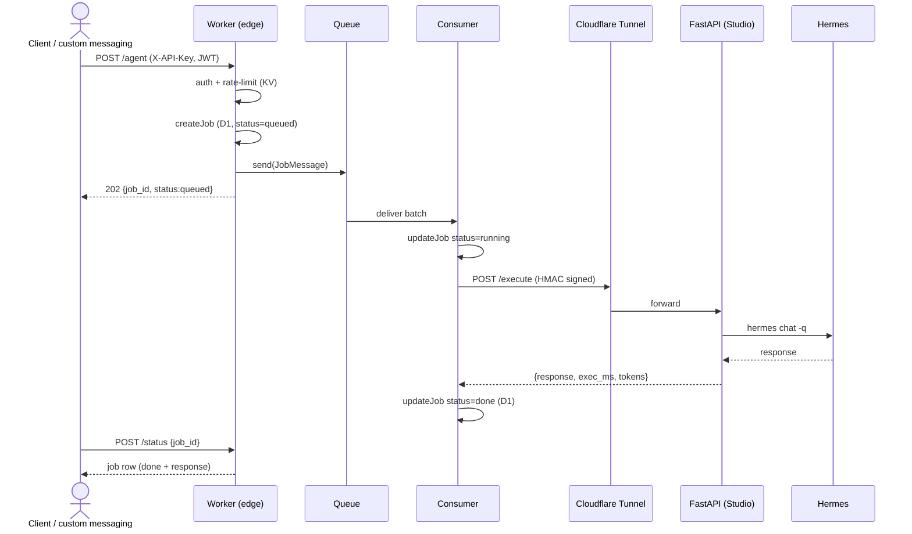
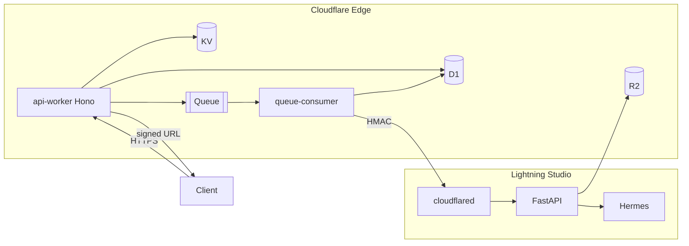

# Architecture

## Request flow

## Components

## Design decisions

- **Async-by-default for agent/deploy.** These are slow and exceed edge CPU
  limits, so they are always queued. `/chat` is also queued for uniformity
  (a sync fast-path can be added later behind a flag).
- **D1 is the source of truth for job state.** The consumer writes status
  transitions (queued→running→done/error); clients poll `/status`.
- **HMAC, not mTLS, for Worker→Studio.** Simpler to operate over a Tunnel and
  sufficient with timestamp + replay-nonce. mTLS can be layered on the Tunnel.
- **Subprocess Hermes bridge.** Decouples the API from Hermes internals and
  survives Hermes upgrades. A long-lived IPC bridge is a future optimization.
- **Streaming later.** The contract returns a Job ID + poll today; SSE/WebSocket
  streaming can be added on `/status?stream=1` without changing the data model.

## Failure handling

- Queue consumer `message.retry()` on upstream failure → Queues retries up to
  `max_retries`, then dead-letters to `terragravity-jobs-dlq`.
- Every failure path writes a `logs` row with the request UUID.
- The Worker never trusts upstream success blindly — non-2xx becomes a job error.
